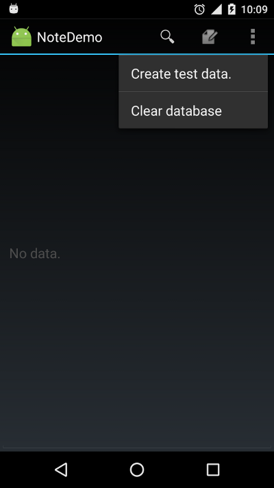

# Android NoteDemo application

http://github.com/dualword/dualword-demo/

minSdkVersion 11

testing:
Instrumented tests

NonsenseGenerator class(Apache License) is from newsreader sample:[link](https://android.googlesource.com/platform/development/+/52c5a27426976853a8b57ea15f60f387e27af202/samples/training/multiscreen/newsreader)

Icons are from NotePad and SearchableDictionary:[link](https://android.googlesource.com/platform/development/+/master/samples/)

